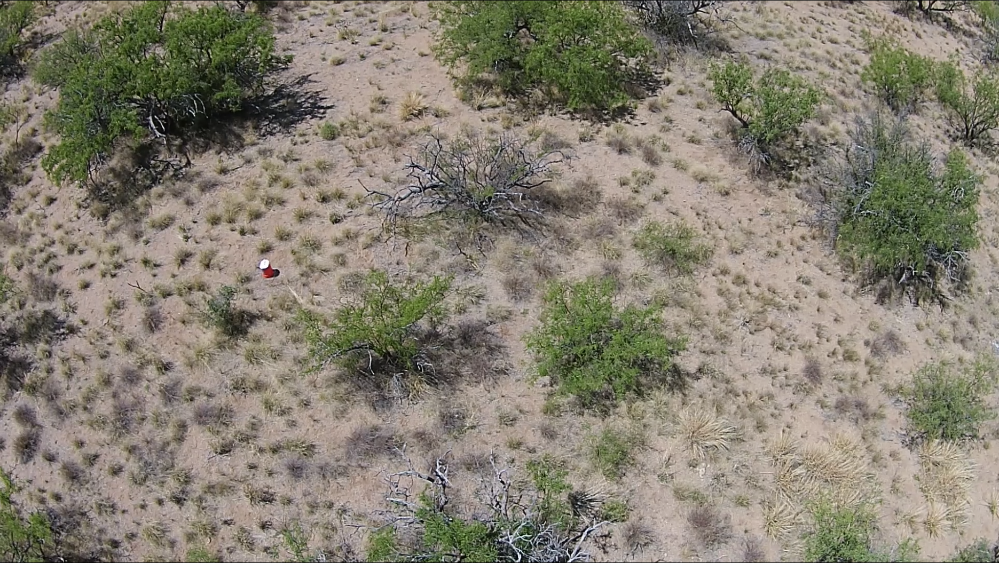
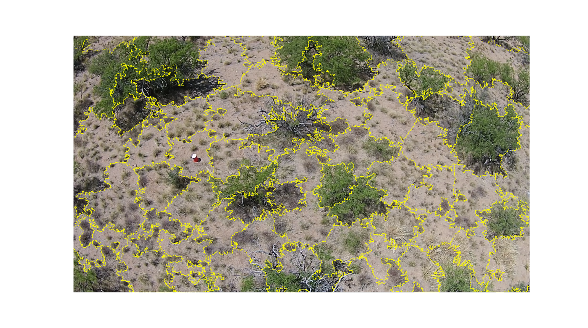
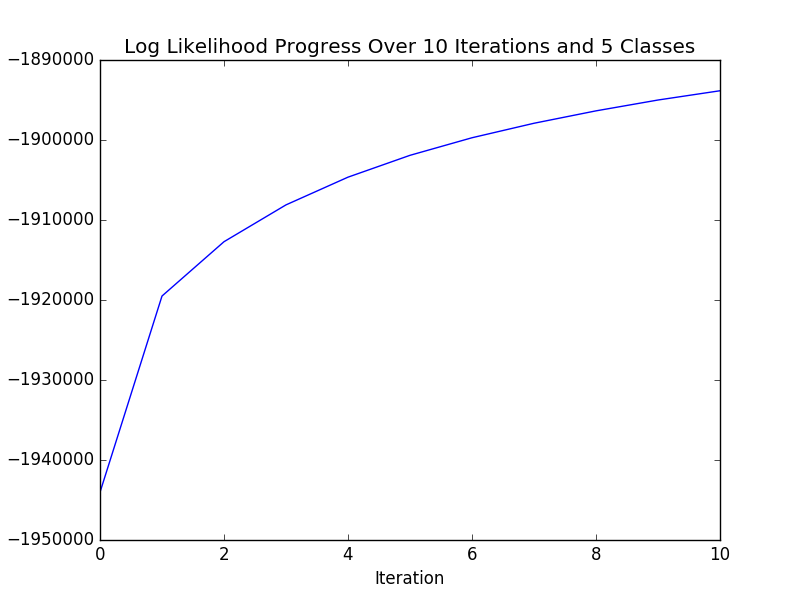
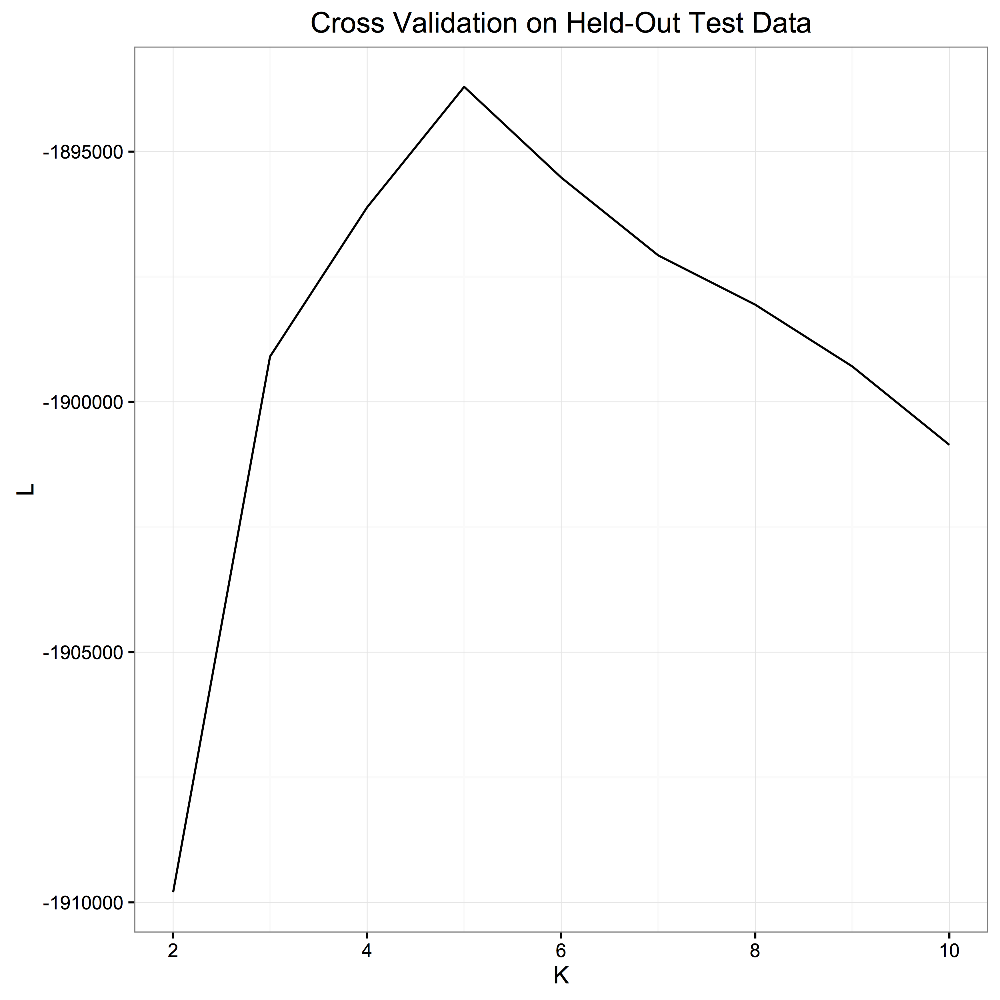

This repository contains scripts to segment images into superpixels and classify superpixels using Expectation Maximation of Gaussian Mixture Models.  The code and analyses contained here are part of some of my early work on the quantification of natural resources from computer vision.

**Image Pre-Processing**

Portable network graphics taken from the DJI Phantom UAV onboard camera are used in this analysis. The onboard camera has 14-megapixel resolution and 120°/ 110°/ 85° field of view. The .png files come with an alpha or transparency layer, which was removed. After removing the alpha layer, each pixel in each image has 3 dimensions: a value between the open interval 0 and 255 (8 bit) for Red, Green, and Blue. For Expectation Maximization (EM) of the Gaussian Mixture Models (GMM), the image was “flattened” to an N by 3 dimensional array, where N = the number of total pixels. Thus, for this analysis, EM was computed on a per pixel basis and spatial information was not used a parameter. Given the size of the imagery, it quickly became clear that this dimensionality reduction will save computational expense.
One single image from the onboard camera contains nearly two million pixels, therefore, a subset of an image was used for evaluation of training a Gaussian Mixture Model(GMM) classifier using Expectation Maximization. Spatial information was incorporated by using a kmeans implementation known as SLIC from the python package skimage.segmentation as discussed below.
The non-subsetted image used in this analysis is shown here:

**Initial Segmentation/Super-Pixel Construction**

The image was initially segmented into superpixels using simple linear iterative clustering (SLIC) and the implementation is contained in the script: slicImageSegmentation.py. The required input parameters are the image and the desired number of segments.

The full, non-subsetted image is segmented into 100, 200, and 300 segments/superpixels as exemplified here:

**Expectation Maximization of Gaussian Mixture Models**

The EM-GMM algorithm is implemented so at to evaluate the most likely class of an individual pixel given the distribution of RGB pixel values as explained by a Gaussian Mixture Model.  
The full algorithm is implemented in the script “EMGMMbyK.py”. In the algorithm, the means of each cluster are initialized with kmeans clustering. The log likelihood is evaluated over 10 EM iterations on the training data and is plotted to show that it is increasing monotonically on the training data (which it should) and  whether it plateauing after 10 iterations, such as I found here:

One-tenth of the datapoints (pixel of RGB values) were held out from the training dataset and used to test the log likelihood as a function of number of classes. The evaluation of the log likelihood on the held-out validation dataset clearly showed that the likelihood peaked at 5 classes, as shown here:

**Future work** should be dedicated to a better sampling scheme for training the GMM, improving efficiency of the algorithm (such as be vectorizing internal for-loops), classifying superpixels from the most common class of individual pixels, merge neighboring superpixels that share the same classification, and then split these objects into distinct objects using a watershed algorithm.  Though it won't necessarily change how the code contained within this repo is written, the alogirthm should, ultimately, be applied to georeferenced, orthophotos.
